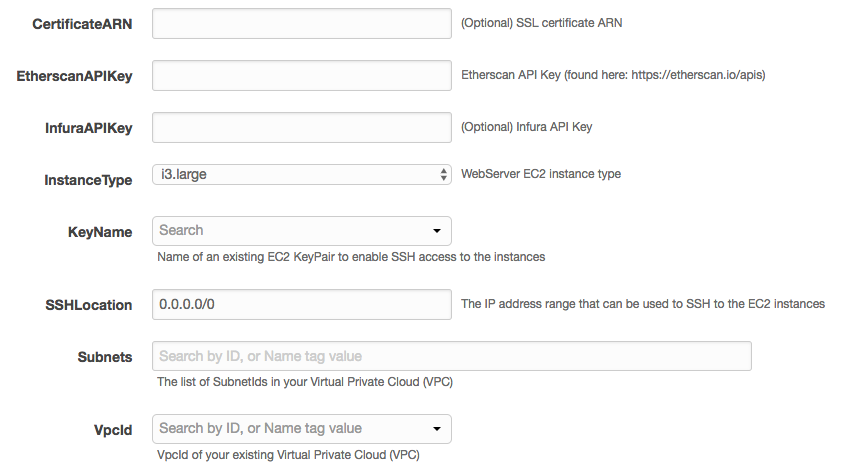

# geth-cloudformation
The Airswap implementation of Geth clustering in a CloudFormation script

### Want to give it a try?

## Features

## Set up
The setup for the Geth cluster is very simple. First, [click here](https://console.aws.amazon.com/cloudformation/home?region=us-east-1#/stacks/new?stackName=GethCluster&templateURL=https://s3.amazonaws.com/opensource.airswap.io/geth/cloudformation.yml) to launch the stack or use the hosted template here: [https://s3.amazonaws.com/opensource.airswap.io/geth/cloudformation.yml](https://s3.amazonaws.com/opensource.airswap.io/geth/cloudformation.yml)

### Specify the settings

#### Certificate ARN
The ARN string for the SSL certificate you want on the load balancer. This is useful if you plan to run the cluster in production, as you will be able to access the load balancer via HTTPS.

This field is optional.

If you specify this field, port 80 access is automatically disabled for security. You will need to create a Route 53 record pointing to the load balancer with the correct DNS name.

#### Etherscan API Key
Prior to starting the stack, you need to register for an Etherscan API key. You can [use the instructions listed here](https://etherscan.io/apis) to create an account and get a new API key.

#### Infura API Key
An optional API key can be provided for Infura. This might result in less rate limiting and better quality of service with Infura when querying their nodes.

#### Instance Type
Select your instance type. We have found that the `i3` and `c5d` families of instances work the best. As such, we have limited the options we present by default to these families. We have also eliminated instance sizes that we know do not have enough power to maintain a sync.

 If you plan to run this cluster for **production**, choose at least a `xlarge` sized instance to handle traffic appropriately. We have found that instances below this size have trouble both syncing and serving requests to the JSON RPC endpoints.

#### Key Name
Specify the SSH key to be used for the EC2 instances. This should be a private key that you have access to in order to log in and debug any issues that may occur.

#### SSH Location
This is the IP CIDR block that should be allowed SSH access. By default, we set it to world accessible. **Please do not set production systems to world accessible!**

#### Subnets
This is a list of the subnets in your VPC where the EC2 instance should be launched. These should be in the same VPC as the VPC selected in the next parameter.

#### VPC Id
The ID of the VPC in which to launch the Geth Cluster. This is customizable for advanced users.

## Production Improvements
If you want to run this cluster in production, we recommend a few improvements prior to subjecting the cluster to production traffic for best performance and security.

* Limit the CORS domains in the Geth configuration
* Evaluate how many Geth nodes you need - the template has a max of 4 and you may need more

## Automated Setup
Just click the button below to get started:

